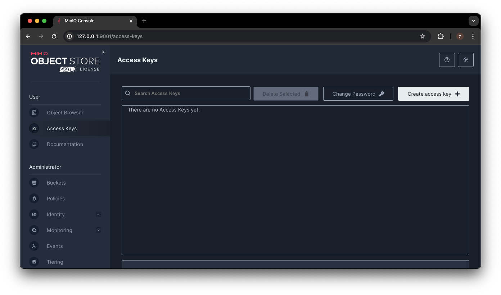
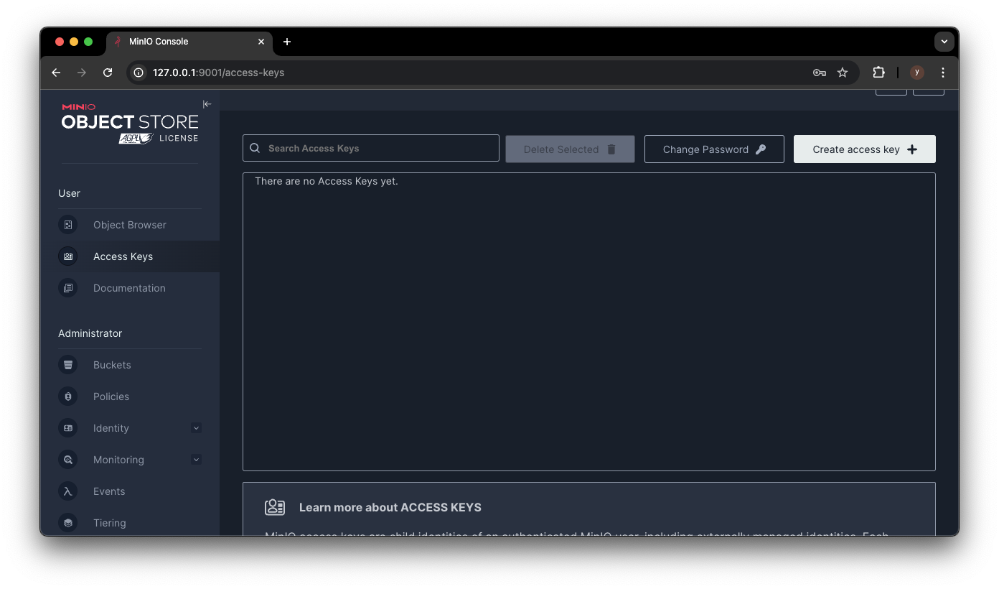
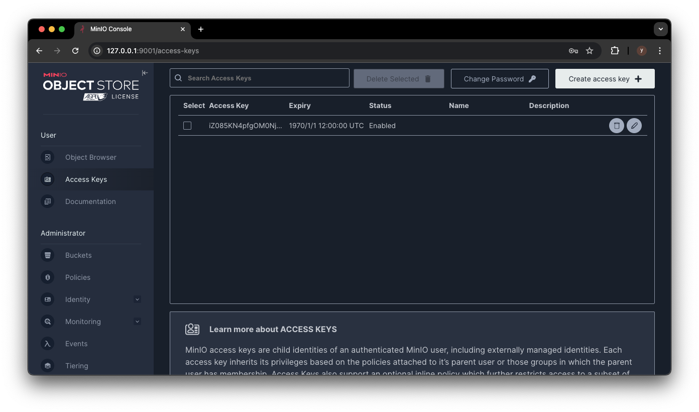

# 開発環境用の s3 ストレージ

## Quick Start

1. `.env`を以下のように作成する

```.env
MINIO_ROOT_USER=<任意のユーザ名>
MINIO_ROOT_PASSWORD=<任意のパスワード>
MINIO_PORT=9000
MINIO_CONSOLE_PORT=9001
```

1. コンテナを起動

```bash
docker-compose up -d
```

1. http://127.0.0.1:57630 にアクセスする

   `.env`で指定した Username と Password でログイン

1. Accsess Key の作成
   Access Keys > Create access key > Create で作成
   デフォルトのままで変更する必要はない
   

   

   

1. test.ipynb を実行
   バケットの作成やファイルのアップロードができることが確認できる。
